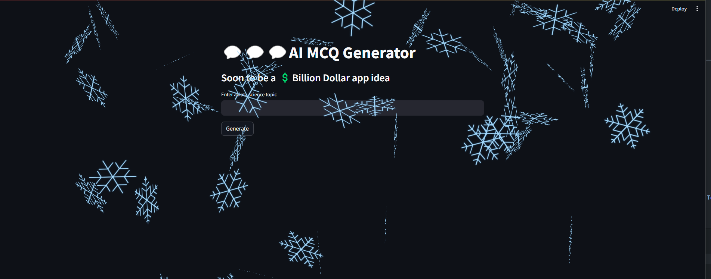

# Building First GenAI Application using OpenAI

#### Step 1: go to https://platform.openai.com/
#### Step 2: Register and verify
#### Step 3: Check limit

#### Step 4: Create `API Key`


#### Step 5: Save the key in local folder `.openai_api_key.txt`
* kept the .[dot] infront of file name so that i'm not accidentily push the code to github.

#### Step 6: Open Key
Way 1: Not so secure
```python
# Very bad way of setting the key. It exposes the key and anyone can steal it.

OPENAI_API_KEY = "THIS_IS_A_DUMMY_KEY"

client = OpenAI(api_key = OPENAI_API_KEY)
```

Way 2: Good way
```python
# This is a good way but, there is a much better ways of setting the API key using .env

f = open('keys/.openai_api_key.txt')
OPENAI_API_KEY = f.read()

client = OpenAI(api_key = OPENAI_API_KEY)
```

way 3: Better way used in production
```python
from dotenv import dotenv_values

config = dotenv_values("keys/.env")

client = OpenAI(api_key = config["OPENAI_API_KEY"])
```
`Note: I can use this client in Chat API, Completion, DALL.E etc`

#### Step 7: write query
```python
response = client.chat.completions.create(
    model='gpt-3.5-turbo',
    messages=[
        {
            "role":"user",
            "content":"Generate 3 data science questions and answer for MCQ test."
        }
    ]
)
```

#### Step 8: Show content
```python
print(response.choices[0].message.content)
```
```
1. What is the purpose of data preprocessing in data science?
   A) To clean and prepare raw data for analysis
   B) To visualize the data for easier interpretation
   C) To deploy predictive models in production
   D) To create dashboard reports for stakeholders
   
   Answer: A) To clean and prepare raw data for analysis

2. Which machine learning algorithm is best suited for classification tasks with binary outcomes?
   A) K-means clustering
   B) Linear regression
   C) Decision tree
   D) Principal Component Analysis (PCA)
   
   Answer: C) Decision tree

3. What is the general process of building a machine learning model?
   A) Collect data, train model, evaluate model, deploy model
   B) Build model, collect data, evaluate data, deploy model
   C) Train model, collect data, preprocess data, evaluate model
   D) Evaluate model, collect data, preprocess data, train model
   
   Answer: A) Collect data, train model, evaluate model, deploy model
```

#### Step 9: OpenAI playgroud: set you output in advance for all query.


#### Step 10: `Add system prompt and user prompt`
```python
prompt = input("Enter a data science topic:")
response = client.chat.completions.create(
    model='gpt-3.5-turbo',
    messages=[
        {
            "role":"system",
            "content": """You are a helpful AI Assistant. Given a Data Science Topic you always generate 3 questions and answer for MCQ test."""
        },
        {
            "role":"user",
            "content":prompt
        }
    ]
)
```
```python
print(response.choices[0].message.content)
```
```
Great! Here are 3 questions along with their answers on the topic of K-Nearest Neighbors (KNN):

1. Question: What is K-Nearest Neighbors (KNN) algorithm used for?
   - A) Classification
   - B) Regression
   - C) Both A and B
   - D) Clustering
   Answer: C) Both A and B

2. Question: How does the KNN algorithm classify a new data point?
   - A) By finding the K nearest data points based on a distance metric
   - B) By calculating the average of the K nearest data points
   - C) By using a clustering algorithm
   - D) By fitting a regression line to the K nearest data points
   Answer: A) By finding the K nearest data points based on a distance metric

3. Question: What is the significance of the 'K' parameter in K-Nearest Neighbors algorithm?
   - A) It determines the number of clusters in the dataset
   - B) It is the number of features in the dataset
   - C) It specifies the number of nearest neighbors to consider for classification
   - D) It is the learning rate for the algorithm
   Answer: C) It specifies the number of nearest neighbors to consider for classification
```
~

#### Step 11: Create steamlit and takes input
```python
import streamlit as st
prompt = st.text_input("Enter data scienc topic")
```

#### Step 12: Crate button on steamlit
```python
if st.botton("Generate") == True:
    # This mean someone click on button
```

#### Step 13: Print the response
```python
st.write(response.choice[0].message.content)
```


#### Step 14: Write a header on streamlit
```python
st.title("💬💬💬AI MCQ Generator")
st.subheader("Soon to be a 💲Billion Dollar app idea")
```


#### Step 15: You can add snow and ballon
```python
st.snow()
st.balloons()
```

